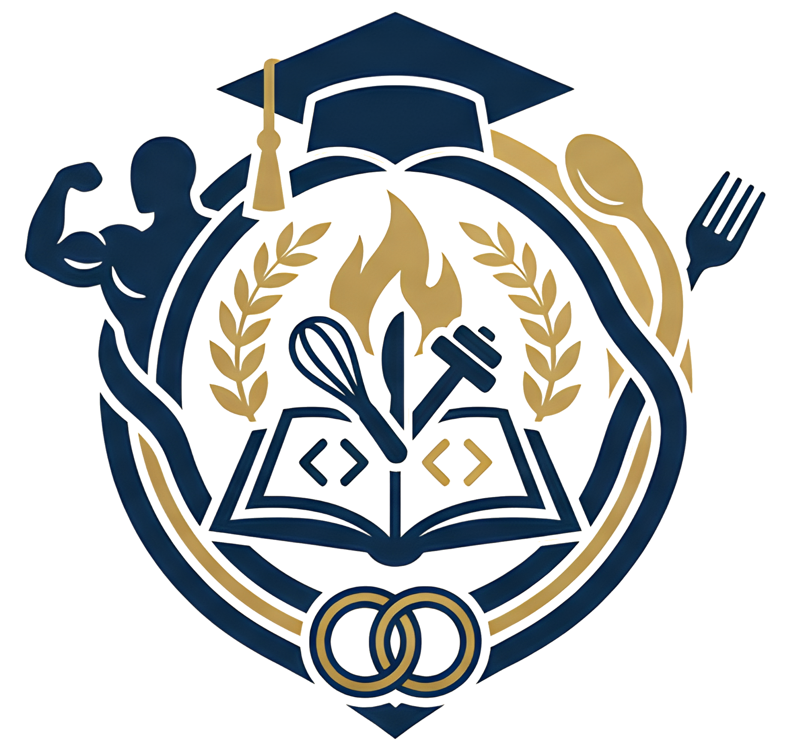

# Principios de Computación y Programación

Material de la asignatura **IBT 114 · Principios de Computación y Programación**, Universidad de Valparaíso.

## Descripción

Sitio web de documentación con los contenidos teóricos y prácticos de la asignatura. Cubre desde los fundamentos de la informática hasta la programación en Python, con ejemplos orientados a la ingeniería.

## Contenidos

- **Introducción**: conceptos de informática, algoritmos, diagramas de flujo y transición a código Python
- **Entornos de desarrollo**: instalación y uso de Visual Studio Code
- **Tipos de datos**: números, cadenas de texto y tipos básicos
- **Control de flujo**: condicionales (`if/elif/else`), bucle `while` y bucle `for`
- **Estructuras de datos**: listas y matrices
- **Modularidad**: funciones

## Tecnologías

- [Zensical](https://github.com/sdelquin/zensical) — generador de sitios estáticos basado en MkDocs Material
- [Mermaid](https://mermaid.js.org/) — diagramas de flujo
- [MathJax](https://www.mathjax.org/) — fórmulas matemáticas
- GitHub Pages — hosting

## Sitio web

🔗 https://benjaminserrano.github.io/principios-programacion

## Autor

Benjamin Serrano — benjamin.serrano@uv.cl
