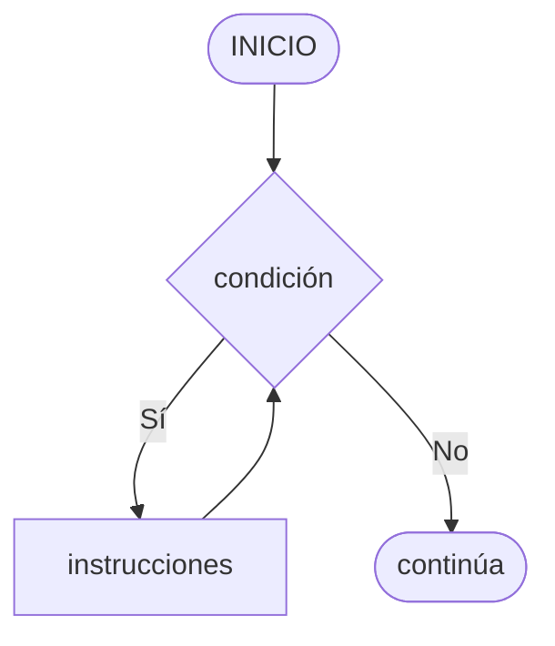
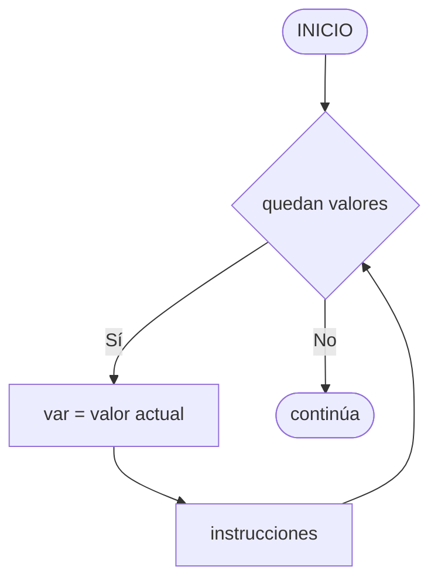

# Bucles { #loops }


/// caption
Imagen generada con Inteligencia Artificial
///

Cuando queremos hacer algo más de una vez, necesitamos recurrir a un **bucle**. En esta sección veremos las distintas sentencias en Python que nos permiten repetir un bloque de código.

## La sentencia `while` { #while }

### Diagrama de flujo { #while-flowchart }

La estructura `while` repite un bloque **mientras** la condición sea verdadera. La condición se evalúa **antes** de cada iteración.



!!! warning "Bucle infinito"

    Si la condición nunca se vuelve falsa, el ciclo se repite indefinidamente. Siempre debe existir una instrucción dentro del bloque que haga que la condición eventualmente sea falsa.

### De diagrama a código { #while-transition }

=== "Diagrama de flujo"

    ``` mermaid
    flowchart TD
        A([INICIO]) --> B["n = 5"]
        B --> C{"n > 0"}
        C -->|Sí| D@{ shape: doc, label: "n" }
        D --> E["n = n - 1"]
        E --> C
        C -->|No| F@{ shape: doc, label: "\"Fin\"" }
        F --> G([FIN])
    ```

=== "Código Python"

    ```python
    n = 5

    while n > 0:
        print(f"n= {n}")
        n = n - 1

    print("Fin")
    ```

=== "Salida"

    ```
    n= 5
    n= 4
    n= 3
    n= 2
    n= 1
    Fin
    ```

!!! danger "Bucle infinito"

    Si ninguna instrucción dentro del bloque modifica la condición, el bucle se repetirá indefinidamente. Siempre debe existir una instrucción que eventualmente haga la condición falsa.

    ```python
    n = 5
    while n > 0:
        print("Hola")   # n nunca cambia → bucle infinito
    ```

### Ejemplos resueltos { #while-examples }

??? example "Ejemplo 1: Validación de un número"

    Solicitar un número entre 1 y 9. Si el usuario ingresa un valor fuera del rango, mostrar error y pedir de nuevo.

    === "Diagrama de flujo"

        ``` mermaid
        flowchart TD
            A([INICIO]) --> B["noValido = True"]
            B --> C{noValido}
            C -->|Sí| D@{ shape: doc, label: "\"Ingrese un número entre 1 y 9\"" }
            D --> E[/num/]
            E --> F{"num >= 1 y num <= 9"}
            F -->|Sí| G["noValido = False"]
            F -->|No| H@{ shape: doc, label: "\"Error: el número está fuera del rango.\"" }
            G --> C
            H --> C
            C -->|No| I@{ shape: doc, label: "\"El número\", num, \"es correcto.\"" }
            I --> J([FIN])
        ```

    === "Código Python"

        ```python
        noValido = True

        while noValido:
            num = int(input("Ingrese un número entre 1 y 9: "))
            if num >= 1 and num <= 9:
                noValido = False
            else:
                print("Error: el número está fuera del rango.")

        print(f"El número {num} es correcto.")
        ```

    === "Ejecución de ejemplo"

        ```
        Ingrese un número entre 1 y 9: 15
        Error: el número está fuera del rango.
        Ingrese un número entre 1 y 9: 0
        Error: el número está fuera del rango.
        Ingrese un número entre 1 y 9: 7
        El número 7 es correcto.
        ```

    !!! note "Variable de control"

        La variable `noValido` actúa como **variable de control**: comienza en `True` asumiendo que el dato es inválido, y solo se pone en `False` cuando el usuario ingresa un valor correcto.

??? example "Ejemplo 2: Invertir un número"

    Recibir un número mayor a cero, extraer sus dígitos y mostrarlo invertido.

    === "Diagrama de flujo"

        ``` mermaid
        flowchart TD
            A([INICIO]) --> B["noValido = True"]
            B --> C{noValido}
            C -->|Sí| D[/num/]
            D --> E{"Es número\ny num > 0"}
            E -->|Sí| F["noValido = False"]
            E -->|No| G@{ shape: doc, label: "\"Error\"" }
            F --> C
            G --> C
            C -->|No| H["ni = 0"]
            H --> I{"num > 0"}
            I -->|Sí| J["d = num % 10"]
            J --> K["ni = ni * 10 + d"]
            K --> L["num = num // 10"]
            L --> I
            I -->|No| M@{ shape: doc, label: "ni" }
            M --> N([FIN])
        ```

    === "Código Python"

        ```python
        noValido = True

        while noValido:
            try:
                num = int(input("Ingrese un número: "))
                if num > 0:
                    noValido = False
                else:
                    print("Error: el número debe ser mayor a 0.")
            except:
                print("Error: la entrada no es un número.")

        ni = 0
        while num > 0:
            d = num % 10        # extrae el último dígito
            ni = ni * 10 + d    # lo agrega al número invertido
            num = num // 10     # elimina el último dígito

        print("Número invertido:", ni)
        ```

    === "Ejecución de ejemplo"

        ```
        Ingrese un número: 2o2e
        Error: la entrada no es un número.
        Ingrese un número: -5
        Error: el número debe ser mayor a 0.
        Ingrese un número: 2023
        Número invertido: 3202
        ```

    !!! tip "¿Cómo funciona la inversión?"

        El algoritmo extrae los dígitos de derecha a izquierda usando el operador módulo `%` y los va acumulando en `ni`:

        | Iteración | `num` | `d` (`num % 10`) | `ni` (`ni * 10 + d`) |
        | :---: | :---: | :---: | :---: |
        | 1 | 2023 | 3 | 3 |
        | 2 | 202 | 2 | 32 |
        | 3 | 20 | 0 | 320 |
        | 4 | 2 | 2 | 3202 |
        | Fin | 0 | — | 3202 |

El primer mecanismo que existe en Python para repetir instrucciones es usar la sentencia `#!python while`. La semántica tras esta sentencia es: "Mientras se cumpla una condición[^1] haz algo".

Veamos un primer <span class="example">ejemplo:material-flash:</span> con un sencillo bucle que repite un saludo mientras así se desee:

```pycon hl_lines="3"
>>> want_greet = 'S'#(1)!

>>> while want_greet == 'S':#(2)!
...     print('Hola qué tal!')
...     want_greet = input('¿Quiere otro saludo? [S/N] ')
... print('Que tenga un buen día')
Hola qué tal!
¿Quiere otro saludo? [S/N] S
Hola qué tal!
¿Quiere otro saludo? [S/N] S
Hola qué tal!
¿Quiere otro saludo? [S/N] N
Que tenga un buen día
```
{ .annotate }

1. Importante dar un valor inicial.
2.  - La condición del bucle se comprueba en cada nueva **iteración** (repetición).
    - En este caso chequeamos que la variable `want_greet`  sea igual a `#!python 'S'`.

!!! note "Iteración"

    En este contexto, llamamos **iteración** a cada "repetición" del bucle. **Iterar** significa "repetir" una determinada acción.

### Romper un bucle while { #while-break }

Python ofrece la posibilidad de romper o finalizar un bucle antes de que se cumpla la condición de parada.

Supongamos que en el <span class="example">ejemplo:material-flash:</span> anterior establecemos **un máximo de 4 saludos**:

```pycon hl_lines="11"
>>> MAX_GREETS = 4

>>> num_greets = 0
>>> want_greet = 'S'

>>> while want_greet == 'S':
...     print('Hola qué tal!')
...     num_greets += 1
...     if num_greets == MAX_GREETS:
...         print('Número máximo de saludos alcanzado')
... ┌────── break
... ↓   want_greet = input('¿Quiere otro saludo? [S/N] ')
... print('Que tenga un buen día')
Hola qué tal!
¿Quiere otro saludo? [S/N] S
Hola qué tal!
¿Quiere otro saludo? [S/N] S
Hola qué tal!
¿Quiere otro saludo? [S/N] S
Hola qué tal!
Número máximo de saludos alcanzado
Que tenga un buen día
```

Como hemos visto en este ejemplo, `#!python break` nos permite finalizar el bucle una vez que hemos llegado al máximo número de saludos. Pero si no hubiéramos llegado a dicho límite, el bucle habría seguido hasta que el usuario indicara que no quiere más saludos.

??? abstract "Solución alternativa"

    Otra forma de resolver este ejercicio sería incorporar la (segunda) condición al bucle:

    ```python
    while want_greet == 'S' and num_questions < MAX_GREETS:
        ...
    ```

#### Comprobar la rotura { #while-else }

Python nos ofrece la posibilidad de **detectar si el bucle ha acabado de forma ordinaria**, esto es, ha finalizado por no cumplirse la condición establecida.

Para ello podemos hacer uso de la sentencia `#!python else` como parte del propio bucle. Si el bucle `#!python while` finaliza normalmente (sin llamada a `#!python break`) el flujo de control pasa a la sentencia opcional `#!python else`.

Veamos su comportamiento siguiendo con el <span class="example">ejemplo:material-flash:</span> que venimos trabajando:

```pycon hl_lines="13"
>>> MAX_GREETS = 4

>>> num_greets = 0
>>> want_greet = 'S'

>>> while want_greet == 'S':
...     print('Hola qué tal!')
...     num_greets += 1
...     if num_greets == MAX_GREETS:
...         print('Máximo número de saludos alcanzado')
...         break
...     want_greet = input('¿Quiere otro saludo? [S/N] ')
... else:#(1)!
...     print('Usted no quiere más saludos')
... print('Que tenga un buen día')
Hola qué tal!
¿Quiere otro saludo? [S/N] S
Hola qué tal!
¿Quiere otro saludo? [S/N] N
Usted no quiere más saludos
Que tenga un buen día
```
{ .annotate }

1. El flujo de control entrará por aquí cuando `want_greet` sea distinto de `#!python 'S'` y por tanto no se cumpla la condición del bucle.

!!! warning "Contexto"

    La sentencia `#!python else` sólo tiene sentido en aquellos **bucles** que contienen un `#!python break`.

### Continuar un bucle while { #while-continue }

Hay situaciones en las que, en vez de romper un bucle, nos interesa **saltar adelante hacia la siguiente iteración**.

Para ello Python nos ofrece la sentencia `#!python continue` que hace precisamente eso, descartar el resto del código del bucle y saltar a la siguiente iteración.

Continuamos con el <span class="example">ejemplo:material-flash:</span> anterior pero ahora vamos a **contar el número de respuestas válidas**:

```pycon hl_lines="10"
>>> want_greet = 'S'
>>> valid_options = 0

>>> while want_greet == 'S':
... ↑   print('Hola qué tal!')
... │   want_greet = input('¿Quiere otro saludo? [S/N] ')
... │   if want_greet not in 'SN':#(1)!
... │       print('No le he entendido pero le saludo')
... │       want_greet = 'S'#(2)!
... └─────  continue#(3)!
...     valid_options += 1
... print(f'{valid_options} respuestas válidas')
... print('Que tenga un buen día')
Hola qué tal!
¿Quiere otro saludo? [S/N] S
Hola qué tal!
¿Quiere otro saludo? [S/N] A
No le he entendido pero le saludo
Hola qué tal!
¿Quiere otro saludo? [S/N] B
No le he entendido pero le saludo
Hola qué tal!
¿Quiere otro saludo? [S/N] N
2 respuestas válidas
Que tenga un buen día
```
{ .annotate }

1. Comprobamos si la entrada es un "sí" o un "no".
2. Asignamos "sí" a la opción para que el bucle pueda seguir funcionando.
3. Saltamos de nuevo al comienzo del bucle.

### Bucle infinito { #infinite-loop }

Si no establecemos correctamente la **condición de parada** o bien el valor de alguna variable está fuera de control, es posible que lleguemos a una situación de bucle infinito, del que nunca podamos salir.

Veamos un <span class="example">ejemplo:material-flash:</span> de esto:

```pycon
>>> num = 1

>>> while num != 10:
...     num += 2
...
^CTraceback (most recent call last):
  Cell In[4], line 1
    while num != 10:
KeyboardInterrupt
```

El problema que surje es que la variable `num` toma los valores 1, 3, 5, 7, 9, 11, ... por lo que nunca se cumple la **condición de parada** del bucle. Esto hace que repitamos "eternamente" la instrucción de incremento.

??? tip "Parar el bucle"

    Para abortar una situación de _bucle infinito_ podemos pulsar en el teclado la combinación ++ctrl+c++. Se puede ver reflejado en el intérprete de Python por `KeyboardInterrupt`.

Una posible solución a este problema sería ^^reescribir la condición de parada^^ en el bucle:

```pycon
>>> num = 1

>>> while num < 10:
...     num += 2
...
```

#### Bucles infinitos como recurso { #infinite-loops-as-resource }

Hay ocaciones en las que un **supuesto bucle "infinito"** puede ayudarnos a resolver un problema.

Si retomamos el <span class="example">ejemplo:material-flash:</span> de los saludos, podríamos reescribirlo utilizando un "bucle infinito" de la siguiente manera:

```pycon
>>> while True:#(1)!
...     print('Hola qué tal!')
...     if (want_greet := input('¿Quiere otro saludo? [S/N] ')) != 'S':#(2)!
...         break#(3)!
... print('Que tenga un buen día')
Hola qué tal!
¿Quiere otro saludo? [S/N] S
Hola qué tal!
¿Quiere otro saludo? [S/N] S
Hola qué tal!
¿Quiere otro saludo? [S/N] N
Que tenga un buen día
```
{ .annotate }

1. Este bucle por sí solo implicaría un bucle infinito, pero veremos que no es así.
2. Usando el [operador morsa](conditionals.md#walrus) pedimos la entrada y comprobamos su valor.
3. La sentencia `#!python break` nos "salva" de este bucle infinito cuando no se quieren más saludos.

En comparación con el enfoque "clásico" del bucle `#!python while`:

- Como ^^ventaja^^ podemos observar que no es necesario asignar un valor inicial a `want_greet` antes de entrar al bucle.
- Como ^^desventaja^^ el código resulta menos "idiomático" ya que la condición del bucle no nos da ninguna pista de lo que está ocurriendo.

## La sentencia `for` { #for }

### Diagrama de flujo { #for-flowchart }

La estructura `for` recorre un **conjunto de valores** definido de antemano. Se usa cuando se sabe cuántas veces se va a repetir.



??? example "Ejemplo resuelto: Pago de remuneraciones"

    Calcular el sueldo bruto y líquido de cada empleado. El valor hora es \$2.500 y el líquido corresponde al 80% del bruto.

    ``` mermaid
    flowchart TD
        A([INICIO]) --> B@{ shape: doc, label: "\"Ingrese cantidad de empleados\"" }
        B --> C[/cant_empleados/]
        C --> D["indice = 0"]
        D --> E{"indice < cant_empleados"}
        E -->|Sí| F@{ shape: doc, label: "\"Ingrese cantidad de horas\"" }
        F --> G[/cant_horas/]
        G --> H["sueldo_bruto = cant_horas * 2500"]
        H --> I["sueldo_liquido = sueldo_bruto * 0.8"]
        I --> J@{ shape: doc, label: "\"Sueldo bruto:\", sueldo_bruto, \"Sueldo líquido:\", sueldo_liquido" }
        J --> K["indice = indice + 1"]
        K --> E
        E -->|No| L([FIN])
    ```

Python permite recorrer aquellos tipos de datos que sean **iterables**, es decir, que admitan iterar[^2] sobre ellos. Algunos ejemplos de **tipos y estructuras de datos iterables** (_que permiten ser iteradas/recorridas_) son: [cadenas de texto](../datatypes/strings.md), [listas](../datastructures/lists.md), [tuplas](../datastructures/tuples.md), [diccionarios](../datastructures/dicts.md), [ficheros](../datastructures/files.md), etc.

La sentencia `#!python for` nos permite realizar esta acción.

A continuación se plantea un <span class="example">ejemplo:material-flash:</span> en el que recorremos (iteramos sobre) una cadena de texto:

```pycon
>>> word = 'Python'

>>> for letter in word:#(1)!
...     print(letter)
...
P
y
t
h
o
n
```
{ .annotate }

1.  - La variable `letter` va tomando cada uno de los elementos de `word`.
    - Dado que `word` es una _cadena de texto_, cada elemento es un [caracter](../datatypes/strings.md#get-char).

!!! note "Variable de asignación"

    La **variable de asignación** que utilizamos en el bucle `#!python for` para ir tomando los valores puede tener **cualquier nombre**. Al fin y al cabo es una variable que definimos según nuestras necesidades.

    Suele ser de buen estilo de programación que sea un **nombre en singular** relacionado con la estructura que recorre:

    - `#!python for item in items:`
    - `#!python for num in numbers:`
    - `#!python for product in products:`
    - `#!python for line in lines:`

### Romper un bucle for { #for-break }

Una sentencia `#!python break` dentro de un `#!python for` rompe el bucle, [igual que veíamos](#while-break) para los bucles `#!python while`.

Veamos un <span class="example">ejemplo:material-flash:</span> recorriendo una cadena de texto y parando el bucle cuando encontremos una letra _t_ minúscula:

```pycon hl_lines="5"
>>> word = 'Python'

>>> for letter in word:
...     if letter == 't':
...         break
...     print(letter)
...
P
y
```

!!! tip "Comprobación de rotura y continuación"

    Tanto la [comprobación de rotura de un bucle](#while-else) como la [continuación a la siguiente iteración](#while-continue) se llevan a cabo del mismo modo que hemos visto con los bucles de tipo `#!python while`.

### Secuencias de números { #range }

Es muy habitual hacer uso de secuencias de números en bucles. Python no tiene una instrucción específica para ello. Lo que sí aporta es una función `#!python range()` que devuelve un flujo de números en el rango especificado[^3].

La técnica para la generación de secuencias de números es muy similar a la utilizada en los ["slices"](../datatypes/strings.md#slicing) de cadenas de texto. En este caso disponemos de la función `#!python range(start, stop, step)`:

| Parámetro | Carácter | Por defecto |
| --- | --- | --- |
| `start` | Opcional | 0 |
| `stop` | <span class="hl">Obligatorio</span> | - |
| `step` | Opcional | 1 |

Veamos distintos casos de uso:

=== "Rango: $[0,1,2]$"

    ```pycon
    >>> for i in range(3):#(1)!
    ...     print(i)
    ...
    0
    1
    2
    ```    
    { .annotate }
    
    1. `#!python start=0`, `#!python stop=3`, `#!python step=1`
        - También se podría haber escrito `#!python range(0, 3)` pero es innecesario.
        - Recordar que al ser _índice 0_, el rango llega hasta 1 menos que el límite superior.

=== "Rango: $[1,3,5]$"

    ```pycon
    >>> for i in range(1, 6, 2):#(1)!
    ...     print(i)
    ...
    1
    3
    5
    ```
    { .annotate }
    
    1. `#!python start=1`, `#!python stop=6`, `#!python step=2`

=== "Rango: $[2,1,0]$"

    ```pycon
    >>> for i in range(2, -1, -1):#(1)!
    ...     print(i)
    ...
    2
    1
    0
    ```
    { .annotate }
    
    1.  - `#!python start=2`, `#!python stop=-1`, `#!python step=-1`
        - Vamos "hacia atrás" por tanto el límite final estará uno por debajo de donde queremos llegar.

!!! warning "i, j, k"

    Se suelen utilizar nombres de variables `i`, `j`, `k` para lo que se denominan **contadores**[^4]. Este tipo de variables toman valores numéricos enteros como en los ejemplos anteriores.
    
    :material-alarm-light:{ .red } No conviene generalizar el uso de estas variables a situaciones en las que, claramente, tenemos la posibilidad de **asignar un nombre semánticamente más significativo**.

#### Usando el guión bajo { #underscore }

Hay situaciones en las que **no necesitamos usar la variable** que toma valores en el rango, sino que únicamente queremos repetir una acción un número determinado de veces.

Para estos casos se suele recomendar usar el **guión bajo** `_` como **nombre de variable**, que da a entender que no estamos usando esta variable de forma explícita:

```pycon
>>> for _ in range(10):
...     print('Repeat me 10 times!')
...
Repeat me 10 times!
Repeat me 10 times!
Repeat me 10 times!
Repeat me 10 times!
Repeat me 10 times!
Repeat me 10 times!
Repeat me 10 times!
Repeat me 10 times!
Repeat me 10 times!
Repeat me 10 times!
```

## Bucles anidados { #nested-loops }

Como ya vimos en las [sentencias condicionales](conditionals.md#if), el **anidamiento** es una técnica por la que incluimos distintos niveles de encapsulamiento de sentencias, unas dentro de otras, con mayor nivel de profundidad.

En el caso de los bucles también es posible hacer anidamiento, tanto para bucles [`while`](#while) como para bucles [`for`](#for).


///caption
Muñecas rusas © [Marina Yufereva](https://www.revista.escaner.cl/node/7197) (Escáner Cultural)
///

Veamos un <span class="example">ejemplo:material-flash:</span> de **2 bucles anidados** en el que generamos **todas las tablas de multiplicar**:

```pycon
>>> for num_table in range(1, 10):#(1)!
...     for mul_factor in range(1, 10):#(2)!
...         result = num_table * mul_factor
...         print(f'{num_table} * {mul_factor} = {result}')
...     print('----------')
...
1 * 1 = 1
1 * 2 = 2
1 * 3 = 3
1 * 4 = 4
1 * 5 = 5
1 * 6 = 6
1 * 7 = 7
1 * 8 = 8
1 * 9 = 9
----------
2 * 1 = 2
2 * 2 = 4
2 * 3 = 6
2 * 4 = 8
2 * 5 = 10
2 * 6 = 12
2 * 7 = 14
2 * 8 = 16
2 * 9 = 18
----------
3 * 1 = 3
3 * 2 = 6
3 * 3 = 9
3 * 4 = 12
3 * 5 = 15
3 * 6 = 18
3 * 7 = 21
3 * 8 = 24
3 * 9 = 27
----------
4 * 1 = 4
4 * 2 = 8
4 * 3 = 12
4 * 4 = 16
4 * 5 = 20
4 * 6 = 24
4 * 7 = 28
4 * 8 = 32
4 * 9 = 36
----------
5 * 1 = 5
5 * 2 = 10
5 * 3 = 15
5 * 4 = 20
5 * 5 = 25
5 * 6 = 30
5 * 7 = 35
5 * 8 = 40
5 * 9 = 45
----------
6 * 1 = 6
6 * 2 = 12
6 * 3 = 18
6 * 4 = 24
6 * 5 = 30
6 * 6 = 36
6 * 7 = 42
6 * 8 = 48
6 * 9 = 54
----------
7 * 1 = 7
7 * 2 = 14
7 * 3 = 21
7 * 4 = 28
7 * 5 = 35
7 * 6 = 42
7 * 7 = 49
7 * 8 = 56
7 * 9 = 63
----------
8 * 1 = 8
8 * 2 = 16
8 * 3 = 24
8 * 4 = 32
8 * 5 = 40
8 * 6 = 48
8 * 7 = 56
8 * 8 = 64
8 * 9 = 72
----------
9 * 1 = 9
9 * 2 = 18
9 * 3 = 27
9 * 4 = 36
9 * 5 = 45
9 * 6 = 54
9 * 7 = 63
9 * 8 = 72
9 * 9 = 81
----------
```
{ .annotate }

1. Para cada valor que toma la variable `num_table` la otra variable `mul_factor` toma todos sus valores.
2. Como resultado tenemos una combinación completa de los valores en el rango especificado.

??? warning "Complejidad ciclomática"

    Podemos añadir todos los niveles de anidamiento que queramos. Eso sí, hay que tener en cuenta que cada nuevo nivel de anidamiento supone un importante aumento de la [complejidad ciclomática](https://es.wikipedia.org/wiki/Complejidad_ciclom%C3%A1tica) de nuestro código, lo que se traduce en mayores tiempos de ejecución.

    :simple-readdotcv: Revisa [este artículo](https://samwho.dev/big-o/) de [Sam Rose](https://samwho.dev/) sobre **Notación O** (*orden de crecimiento*).

## Ejercicios { #exercises }

### Diagramas de flujo { #exercises-flowcharts }

1. Diseña el diagrama de flujo de un algoritmo que reciba un número mayor a cero, extraiga sus dígitos y lo muestre invertido.
2. Diseña el diagrama de flujo del algoritmo que calcule el promedio de notas de un curso. Por cada estudiante se ingresan sus notas; al terminar, el programa pregunta si se desea ingresar otro estudiante. Al finalizar, muestra el promedio general del curso.

### Programación { #exercises-coding }

1. Escribe un programa que solicite un número entero positivo y muestre la suma de todos los números del 1 hasta ese número.
2. Escribe un programa que solicite un número entero positivo y muestre su tabla de multiplicar del 1 al 10.
3. Escribe un programa que solicite un número entero positivo y determine si es **primo** (solo divisible por 1 y por sí mismo).
4. Escribe un programa que muestre los primeros N números de la **serie de Fibonacci**, donde N es ingresado por el usuario.
5. Escribe un programa que solicite un número entero positivo y muestre un triángulo de asteriscos de esa altura:

    ```
    *
    **
    ***
    ****
    *****
    ```

6. Escribe un programa que solicite números al usuario indefinidamente hasta que ingrese un 0. Al terminar muestra la suma, el promedio, el mayor y el menor de los números ingresados.
7. Escribe un programa que calcule el promedio de notas de un curso. Por cada estudiante se ingresan sus notas; al terminar se pregunta si se desea ingresar otro estudiante. Al finalizar muestra el promedio general del curso.
8. Escribe un programa que solicite la cantidad de pasos caminados y calcule la distancia en kilómetros (1 paso = 80 cm). El programa debe validar que el número de pasos sea positivo.
9. Escribe un programa que calcule la suma de los números del 1 al N, donde N es ingresado por el usuario. Valida que N sea mayor a 0.
[^1]: Esta condición del bucle se conoce como **condición de parada**.
[^2]: Realizar cierta acción varias veces. En este caso la acción es tomar cada elemento.
[^3]: Una de las grandes ventajas es que la "lista" generada no se construye explícitamente, sino que cada valor se genera bajo demanda. Esta técnica mejora el consumo de recursos, especialmente en términos de memoria.
[^4]: Esto viene de tiempos antiguos en [FORTRAN](https://fortran-lang.org/es/index) donde `i` era la primera letra que tenía valor entero por defecto.
