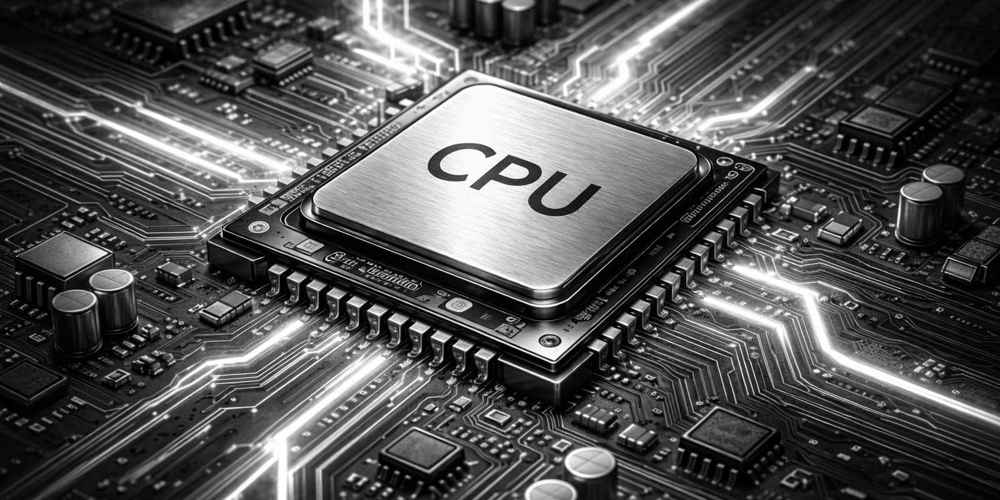
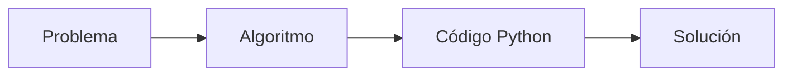
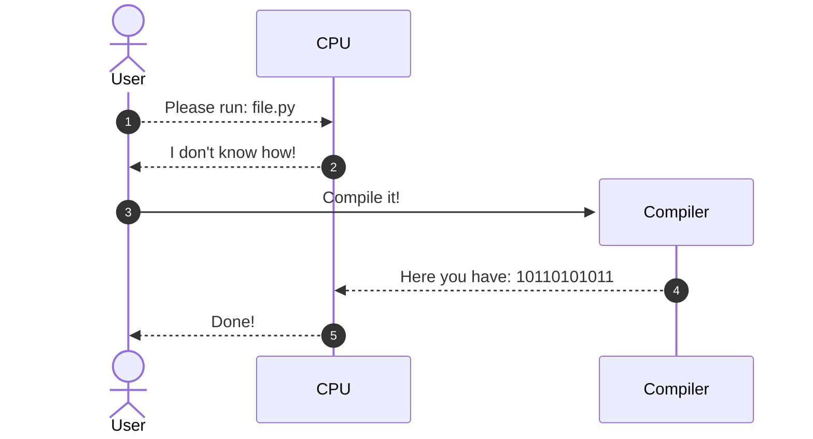
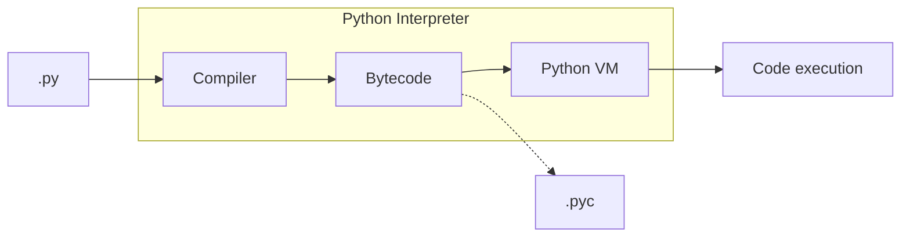

# Hablando con la máquina { #talking-to-machine }


/// caption
Imagen generada con Inteligencia Artificial
///

Los computadores son dispositivos complejos pero están diseñados para hacer una cosa bien: **ejecutar aquello que se les indica**. La cuestión radica en cómo indicarle a una máquina lo que queremos que haga. Esas indicaciones se llaman técnicamente **instrucciones** y se expresan en un **lenguaje**. Podríamos decir que _programar consiste en escribir instrucciones para que sean ejecutadas por un computador_. El lenguaje que utilizamos para ello se denomina _lenguaje de programación_.

## El computador { #computer }

Un **computador** es un dispositivo electrónico diseñado para recibir, procesar, almacenar y producir información útil para el usuario. Su función esencial consiste en transformar datos en resultados mediante la ejecución ordenada de instrucciones o programas.

Los componentes principales del computador se agrupan en dos grandes categorías: **hardware** y **software**.

### Hardware { #hardware }

El hardware corresponde a todos los **componentes físicos** del computador:

| Componente | Descripción | Ejemplo |
| --- | --- | --- |
| **CPU** (Unidad central de procesamiento) | Ejecuta instrucciones y procesa datos | Intel Core i7, AMD Ryzen 5 |
| **Memoria RAM** | Almacena temporalmente los datos del programa en ejecución | 16 GB DDR4 |
| **Unidad de almacenamiento** | Guarda permanentemente la información | Disco SSD, HDD |
| **Tarjeta gráfica** | Procesa información gráfica y visual | NVIDIA GeForce, AMD Radeon |

### Software { #software }

El software es el conjunto de programas e instrucciones que permiten al computador realizar tareas:

- **Sistema operativo**: Administra el hardware y permite la ejecución de otros programas (ejemplos: Windows, Linux, macOS).
- **Software de aplicación**: Programas diseñados para tareas específicas como procesadores de texto, hojas de cálculo, navegadores web, etc.

## Herramientas de apoyo { #support-tools }

Las herramientas de apoyo informático son programas que facilitan y optimizan la realización de tareas específicas en diversas áreas profesionales y académicas:

- :material-chart-scatter-plot: **Análisis científico y técnico**: MATLAB, R, SPSS.
- :material-database: **Gestión de bases de datos**: MySQL, Microsoft Access.
- :material-file-document: **Ofimática**: Microsoft Office (Word, Excel, PowerPoint), Google Workspace.
- :material-language-python: **Programación general**: Python, que usaremos durante esta asignatura.

## Algoritmos { #algorithms }

Antes de programar, es necesario diseñar una **solución** al problema que queremos resolver. Esta solución toma la forma de un **algoritmo**.

!!! info "Definición"

    Un **algoritmo** es una secuencia ordenada de pasos, libre de ambigüedad, tal que al llevarse a cabo producirá el resultado para el que fue diseñado en un tiempo finito.

### Características de un algoritmo { #algorithm-features }

- :material-check: **Finito**: tiene un número determinado de pasos.
- :material-check: **Definido**: cada paso está claramente especificado.
- :material-check: **Efectivo**: cada paso puede ser ejecutado.

### Algoritmos en el día a día { #everyday-algorithms }

Los algoritmos no son exclusivos de la computación. Los usamos constantemente:

=== "Hacer un café"

    1. Calentar agua.
    2. Colocar el filtro y el café en la cafetera.
    3. Verter el agua caliente.
    4. Esperar que filtre.
    5. Servir en una taza.

=== "Sumar dos números"

    Por ejemplo, sumar **256 + 128**:

    1. Sumar dígitos de las unidades: 6 + 8 = 14. Anotar 4, arrastrar 1.
    2. Sumar dígitos de las decenas: 5 + 2 + 1 = 8. Anotar 8.
    3. Sumar dígitos de las centenas: 2 + 1 = 3. Anotar 3.
    4. Resultado: **384**.

=== "Pagar con tarjeta"

    1. Acercar o insertar la tarjeta en el terminal.
    2. Seleccionar el tipo de pago (débito o crédito).
    3. Si es crédito, seleccionar número de cuotas.
    4. Ingresar el PIN.
    5. Si el PIN es incorrecto, mostrar error y volver al paso 4 (máximo 3 intentos).
    6. Si se superaron los intentos, bloquear la tarjeta y terminar.
    7. Verificar que haya saldo suficiente.
    8. Si no hay saldo, mostrar error y terminar.
    9. Descontar el monto de la cuenta.
    10. Emitir comprobante.

=== "Calcular promedio de notas"

    Para calcular el promedio de un estudiante con _n_ notas:

    1. Solicitar la cantidad de notas a ingresar.
    2. Si la cantidad es menor o igual a cero, mostrar error y terminar.
    3. Inicializar la suma en 0.
    4. Para cada nota:
        1. Solicitar el valor de la nota.
        2. Si la nota no está entre 1.0 y 7.0, mostrar error y pedirla nuevamente.
        3. Sumar la nota al acumulado.
    5. Dividir la suma por la cantidad de notas.
    6. Mostrar el promedio.

### Ejercicio: ¿Puedes pensarlo como algoritmo? { #algorithm-exercise }

Antes de ver la solución, intenta escribir en papel los pasos necesarios para resolver el siguiente problema:

!!! exercise "Sacar dinero en un cajero automático"

    Describe el algoritmo completo para retirar dinero de un cajero. Considera que:

    - El cajero puede estar **sin dinero**.
    - El PIN puede ser **incorrecto** (máximo 3 intentos antes de bloquear la tarjeta).
    - El monto solicitado puede ser **mayor al saldo disponible**.
    - Solo se pueden retirar **múltiplos de $1.000**.

    Piensa: ¿cuántos pasos tiene realmente algo tan cotidiano?

??? info "Ver solución"

    1. Insertar la tarjeta en el cajero.
    2. Verificar si el cajero tiene dinero disponible. Si no tiene, mostrar mensaje y devolver la tarjeta.
    3. Ingresar el PIN.
    4. Verificar si el PIN es correcto.
        - Si es incorrecto, incrementar el contador de intentos fallidos.
        - Si se alcanzaron 3 intentos fallidos, bloquear la tarjeta, mostrar mensaje y terminar.
        - Si es correcto, continuar.
    5. Mostrar el saldo disponible en pantalla.
    6. Solicitar el monto a retirar.
    7. Verificar que el monto sea múltiplo de $1.000. Si no lo es, mostrar error y volver al paso 6.
    8. Verificar que el monto no supere el saldo disponible. Si lo supera, mostrar error y volver al paso 6.
    9. Descontar el monto del saldo de la cuenta.
    10. Entregar el dinero físicamente.
    11. Preguntar si desea realizar otra operación.
        - Si responde sí, volver al paso 5.
        - Si responde no, continuar.
    12. Imprimir comprobante de la operación.
    13. Devolver la tarjeta.

### Relación con la programación { #relation-with-programming }

La programación implica la **implementación de algoritmos** destinados a solucionar problemas particulares. Un programa informático es la materialización de un algoritmo escrito en un lenguaje de programación.



## Código máquina { #machine-code }

Pero aún no hemos resuelto el problema de cómo hacer que un computador (o máquina) entienda un lenguaje de programación. A priori se podría decir que un computador sólo entiende un lenguaje muy "simple" denominado [código máquina](https://es.wikipedia.org/wiki/Lenguaje_de_m%C3%A1quina). En este lenguaje se utilizan únicamente los símbolos <span class="red">0</span> y <span class="green">1</span> en representación de los niveles de tensión alto y bajo, que al fin y al cabo, son los estados que puede manejar un [circuito digital](https://es.wikipedia.org/wiki/Circuito_digital). En este contexto, por tanto, hablamos de [sistema binario](https://es.wikipedia.org/wiki/Sistema_binario). Si tuviéramos que escribir programas de computador en este formato sería una tarea ardua, pero afortunadamente con el tiempo se han ido creando lenguajes de programación intermedios que, posteriormente, son convertidos a código máquina.

Si intentamos visualizar un programa en código máquina, únicamente obtendríamos una secuencia de ceros y unos:

```
00001000 00000010 01111011 10101100 10010111 11011001 01000000 01100010
00110100 00010111 01101111 10111001 01010110 00110001 00101010 00011111
10000011 11001101 11110101 01001110 01010010 10100001 01101010 00001111
11101010 00100111 11000100 01110101 11011011 00010110 10011111 01010110
```

## Ensamblador { #assembly }

El primer lenguaje de programación que encontramos en esta "escalada" es **ensamblador**. Veamos a continuación un [ejemplo de código en ensamblador](https://medium.com/nabucodonosor-editorial/hola-mundo-ensamblado-x86-ff62789ab9b0) del típico programa que se escribe por primera vez, el _"Hello, World"_:

```asm
SYS_SALIDA equ 1

section .data
    msg db "Hello, World",0x0a
    len equ $ - msg ;longitud de msg

section .text
global _start ;para el linker
_start: ;marca la entrada
    mov eax, 4 ;llamada al sistema (sys_write)
    mov ebx, 1 ;descripción de archivo (stdout)
    mov ecx, msg ;msg a escribir
    mov edx, len ;longitud del mensaje
    int 0x80 ;llama al sistema de interrupciones

fin: mov eax, SYS_SALIDA ;llamada al sistema (sys_exit)
    int 0x80
```

Aunque resulte difícil de creer, lo "único" que hace este programa es mostrar en la pantalla de nuestro computador el texto `Hello, World`.

Un detalle fundamental es que sólo funcionará para una [arquitectura x86](https://es.wikipedia.org/wiki/X86), ya que las instrucciones en ensamblador están vinculadas con el tipo de arquitectura del procesador.

## C { #c }

Aunque el lenguaje ensamblador nos facilita un poco la tarea de desarrollar programas, sigue siendo bastante complicado ya que las instrucciones son muy específicas y no proporcionan una semántica entendible. Uno de los lenguajes que vino a suplir – en parte – estos obstáculos fue [C](<https://es.wikipedia.org/wiki/C_(lenguaje_de_programaci%C3%B3n)>). Considerado para muchas personas como un referente en cuanto a los lenguajes de programación, permite hacer uso de instrucciones más claras y potentes. El mismo ejemplo anterior del programa _"Hello, World"_ se escribiría así en lenguaje C:

```c
#include <stdio.h>

int main() {
    printf("Hello, World");
    return 0;
}
```

## Python { #python }

Si seguimos "subiendo" en esta lista de lenguajes de programación, podemos llegar hasta [Python](https://es.wikipedia.org/wiki/Python). Se dice que es un lenguaje de más alto nivel en el sentido de que sus instrucciones son más entendibles por un humano. Veamos cómo se escribiría el programa _"Hello, World"_ en el lenguaje de programación Python:

```python
print('Hello, World')
```

¡Pues así de fácil! :material-robot-happy-outline:{.hl} Hemos pasado de _código máquina_ (ceros y unos) a código Python en el que se puede entender perfectamente lo que estamos indicando al computador. La pregunta que surge es: ¿cómo entiende una máquina lo que tiene que hacer si le pasamos un programa hecho en Python (o cualquier otro lenguaje de programación de alto nivel)? La respuesta es un **compilador**.

## Compiladores { #compilers }

Los [compiladores](https://es.wikipedia.org/wiki/Compilador) son programas que convierten un lenguaje "cualquiera" en _código máquina_. Se pueden ver como traductores, permitiendo a la máquina interpretar lo que queremos hacer.



En el caso particular de Python el proceso de compilación genera un código intermedio denominado **bytecode**.

Si partimos del ejemplo anterior:

```python
print('Hello, World')
```

el programa se compilaría[^1] al siguiente "bytecode":

```asm
0           0 RESUME                   0

1           2 PUSH_NULL
            4 LOAD_NAME                0 (print)
            6 LOAD_CONST               0 ('Hello, World')
            8 PRECALL                  1
           12 CALL                     1
           22 RETURN_VALUE
```

A continuación estas instrucciones básicas son ejecutadas por el intérprete de "bytecode" de Python (o máquina virtual)[^2]:



!!! tip ".pyc"

    Los ficheros `.pyc` (del inglés "Python compiled") contienen _bytecode_ en formato binario[^3]. Son generados por el compilador de Python. Su objetivo principal es optimizar la ejecución de un programa, ya que si el código fuente no cambia, no es necesario volver a recompilar.

### Compilado vs Interpretado

Si queremos ver una diferencia entre un lenguaje compilado como C y un lenguaje "interpretado" como Python es que, aunque ambos realizan un proceso de traducción del código fuente, la compilación de C genera un código objeto que debe ser ejecutado en una segunda fase explícita, mientras que la compilación de Python genera un "bytecode" que se ejecuta (interpreta) de forma "transparente".

[^1]: Consulta aquí más información sobre el [intérprete de bytecode](https://devguide.python.org/internals/interpreter/).
[^2]: Imagen basada en el artículo [Python bytecode analysis](https://nowave.it/python-bytecode-analysis-1.html).
[^3]: Es posible incluso obtener el _bytecode_ (legible) desde un fichero `.pyc`. Aquí tienes este [post](https://mathspp.com/blog/til/read-bytecode-from-a-pyc-file) donde se explica claramente.
